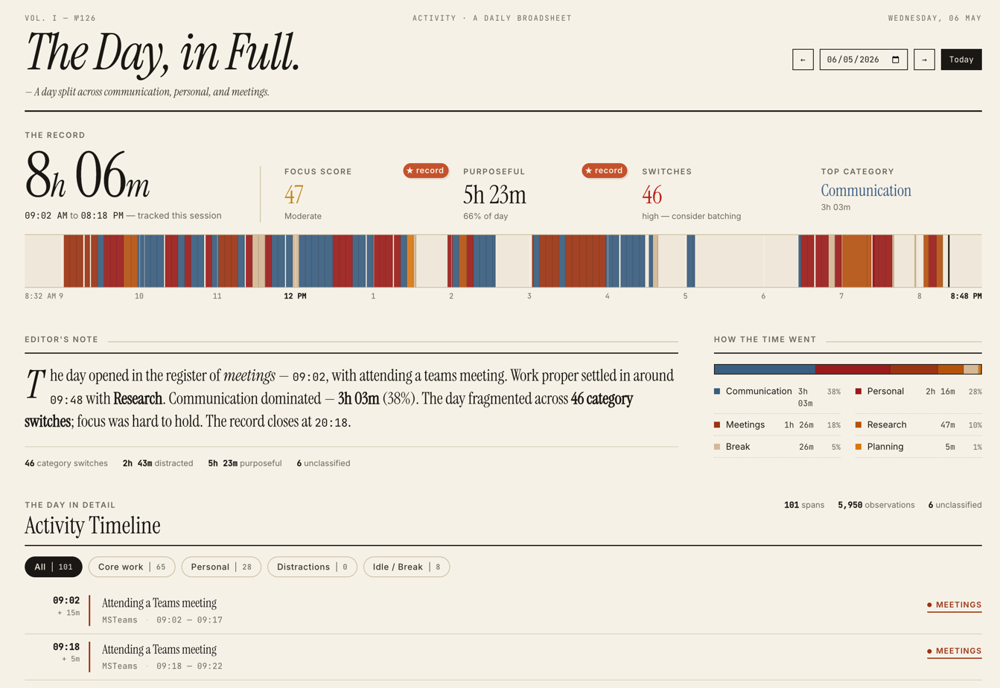
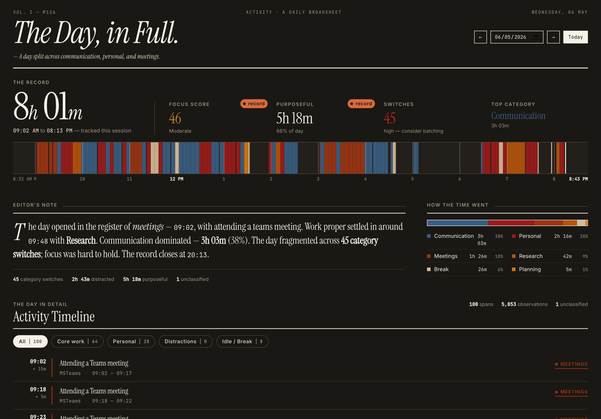
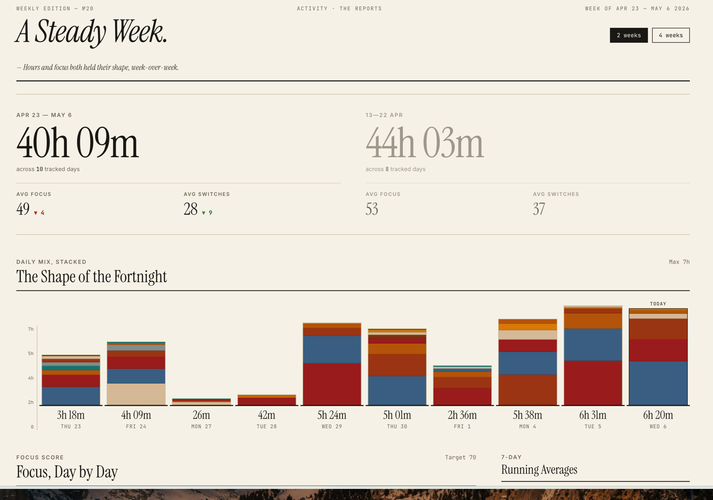
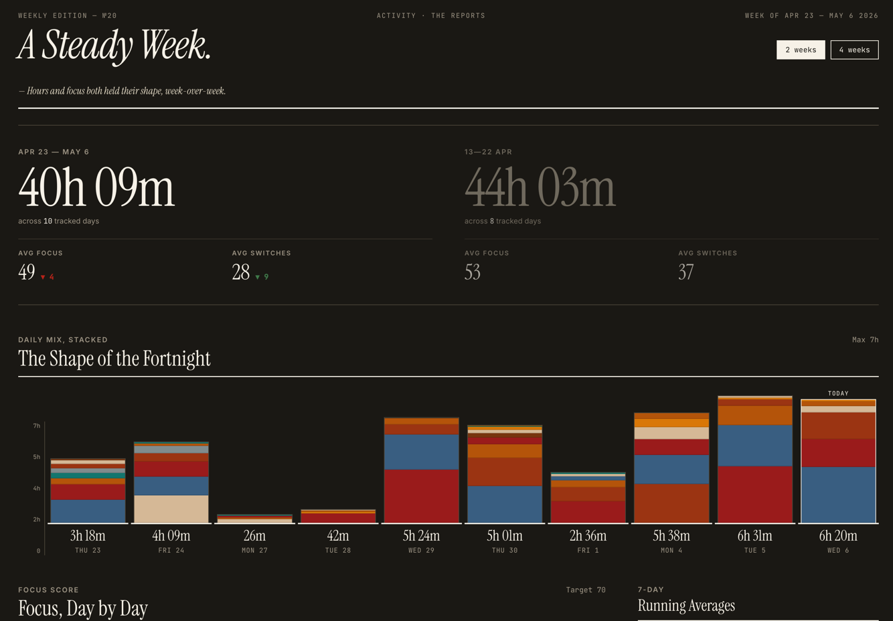
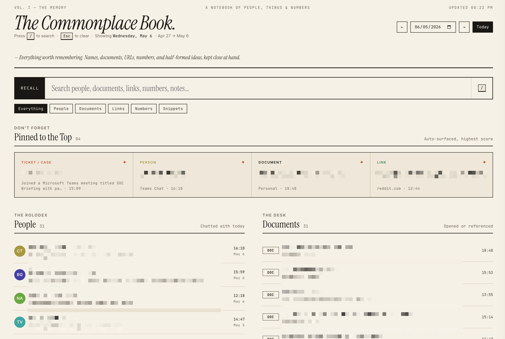

# Commonplace

A local-first macOS activity tracker with AI-powered classification, a daily commonplace book, and an MCP server for Claude.

Everything stays on your machine. No cloud, no telemetry, no accounts.

## What it does

- **Captures** the frontmost app, window title, and browser URL every 5 seconds. Takes a screenshot every 30 seconds.
- **Classifies** activity into categories (Development, Meetings, Communication, …) using a local Ollama model.
- **Remembers** the people you talked to, the documents you opened, the tickets you touched, the links you read — surfaced as a daily *commonplace book*.
- **Talks to Claude** via an MCP server, so you can ask "what did I read about X last week?" or "who did I last meet with from Acme?" and get answers grounded in your actual activity.

## Screenshots

**Dashboard** — today's timeline, hourly bars, focus score, category breakdown.



<details><summary>Dark mode</summary>



</details>

**Reports** — week-on-week trends and category comparison.



<details><summary>Dark mode</summary>



</details>

**Commonplace Book** — your daily memory: people, documents, links, tickets, snippets — searchable, with a click-to-zoom panel for each person.



## Requirements

- macOS (the capture daemon uses AppleScript and `screencapture`)
- Python 3.10+
- [Ollama](https://ollama.com/) running locally with a model pulled (default: `qwen3:8b`)

## Install

```bash
git clone https://github.com/bharatrameshwar/commonplace.git
cd commonplace

# Create venv and install
python3 -m venv .venv
.venv/bin/pip install -e .

# Configure
cp config.example.yaml config.yaml
$EDITOR config.yaml   # set user_profile.name, role, self_aliases

# Pull the AI model (or edit config.yaml to use a different one)
ollama pull qwen3:8b

# Install launchd agents (capture, dashboard, classifier, cleanup)
./scripts/install.sh

# Open the dashboard
open http://127.0.0.1:8420
```

To stop everything:

```bash
./scripts/install.sh --uninstall
```

## Configuration

`config.yaml` is read at startup. The most important section is `user_profile`:

```yaml
user_profile:
  name: "Jane Doe"
  self_aliases:
    - "jane doe"
    - "doe, jane"
  role: "Software engineer"
  organization: "Acme Corp"     # optional, used in classifier prompt
  person_stopwords:             # words that look like names but aren't
    - "Acme"
    - "Project Phoenix"
```

Filling these in keeps:
- Your own name out of the people-detector and the daily commonplace book.
- AI classifications grounded in your actual role.
- Internal product/project names from being mistaken for people.

## AI (Ollama)

Commonplace runs all AI locally through [Ollama](https://ollama.com/). Nothing is sent to any external API — your activity stays on your machine.

The default model is **`qwen3:8b`** — a balanced choice that fits comfortably on a 16GB Mac and handles classification, memory extraction, and weekly per-person summaries well. Pull it once with `ollama pull qwen3:8b`.

Configure under `ai:` in `config.yaml`:

```yaml
ai:
  ollama_url: "http://localhost:11434"
  model: "qwen3:8b"
```

Or override per-process with environment variables — `OLLAMA_URL`, `OLLAMA_MODEL`.

### Where AI is used

- **Classifier** (`local_classifier.py`, runs every 5 min) — categorises each span into Development / Meetings / Communication / etc., and writes a one-line description.
- **Memory enrichment** (same daemon, second pass) — extracts tickets, people, documents, links, snippets from each classified span; this populates the Commonplace Book.
- **Weekly per-person summaries** (`tracker/people_summary.py`, nightly via `cleanup.py`) — for each person you interacted with in the last 7 days, generates 2-3 sentences summarising what you discussed.
- **Daily digest** (dashboard `/api/digest`) — a 3-5 sentence narrative summary of your day on demand.

The capture daemon, dashboard rendering, search, and people-extraction don't use AI — they're plain Python and SQL.

### Trying other models

Anything Ollama can serve will work — adjust `model:` in `config.yaml` and pull it. Some that have been tested:

| Model | Size | Notes |
|---|---|---|
| `qwen3:8b` | ~5GB | Default. Good balance of quality and speed. |
| `qwen3:4b` | ~3GB | Faster on smaller machines; classifications are slightly noisier. |

Larger models (14B+) work but are usually slower than the value warrants for this kind of structured-output task. Models without strong instruction-following or JSON-mode support tend to produce malformed outputs that get silently discarded.

### If Ollama isn't running

The classifier daemon logs `Ollama not running or model not available. Skipping.` and tries again next interval — capture continues unaffected. Classified categories and memory items just won't appear until Ollama comes back up.

## What runs where

| Component | Path | Purpose |
|---|---|---|
| Capture daemon | `daemon.py` | Polls active app every 5s; takes screenshots every 30s |
| Classifier | `local_classifier.py` | Runs every 5 minutes; categorises spans + extracts memory items via Ollama |
| Dashboard | `dashboard.py` | Flask server on `127.0.0.1:8420` |
| Cleanup | `cleanup.py` | Daily at 3am; prunes old screenshots/observations; refreshes per-person weekly summaries |
| MCP server | `mcp_server.py` | Tools for Claude/Claude Code to search your activity |

Data lives in `~/.local/share/commonplace/`.

## Pages

- `/` — today's dashboard (timeline, hourly bars, focus score)
- `/reports` — weekly trends and category comparison
- `/search` — the **Commonplace Book**: today's people, documents, links, tickets, snippets — searchable, with a click-to-zoom panel for each person showing their weekly summary

## MCP server

Add to your Claude Desktop or Claude Code config:

```json
{
  "mcpServers": {
    "commonplace": {
      "command": "/path/to/commonplace/.venv/bin/python",
      "args": ["/path/to/commonplace/mcp_server.py"]
    }
  }
}
```

Then ask Claude things like *"what was I working on yesterday afternoon?"* or *"summarise my last week of meetings with Lochner."*

## Architecture notes

SQLite for storage (FTS5 for search). Plain Flask for the dashboard. PyYAML for config. No JS framework — the templates are server-rendered HTML with vanilla JS sprinkles.

Capture is macOS-specific. A port to Windows or Linux would need to swap three concrete layers:

- **Active window + browser URL** — currently AppleScript via `osascript`, called from `daemon.py` and `tracker/browser.py`. Replace with the OS-native equivalent (Win32 `GetForegroundWindow` + UIA on Windows; X11/Wayland tooling on Linux).
- **Screenshots** — currently `screencapture` shelled out from `tracker/screenshot.py`. Replace with `mss`, `PIL.ImageGrab`, or platform APIs.
- **Scheduling** — currently `launchd` plists in `scripts/launchd/`. Replace with Task Scheduler, systemd user units, or cron.

Everything else (the SQLite schema, dashboard, classifier, MCP server, people extraction, config loader) is platform-agnostic Python and ports cleanly.

## Contributing

PR-only workflow. Main is locked. See [CONTRIBUTING.md](CONTRIBUTING.md).

## License

MIT — see [LICENSE](LICENSE).
